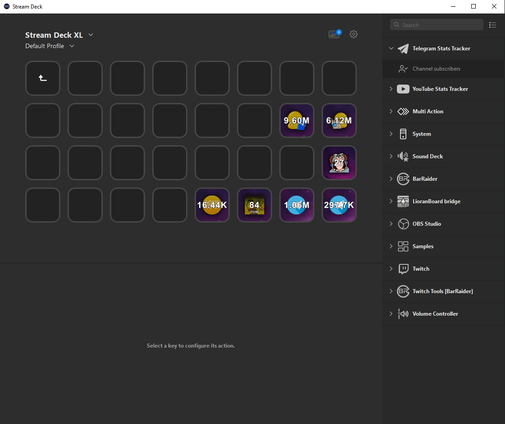
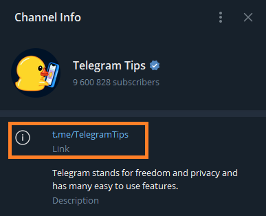

`Telegram Stats Tracker` will help you track the statistics on Telegram.

# Description

With this plugin you can easily track the statistic of your favorite Telegram channel.

- Track Telegram channel statistics:
  - Members count
- Refreshes every 5 minutes
- Pressing the button will open the corresponding channel
- Cross-platform (macOS, Windows)

# Plugin Installation

- Download the [latest version](https://github.com/ArtemNeFRiT/elgato-youtube-statistics/releases/latest) of the plugin.
- Unzip it and place `com.nefrit.telegram.sdPlugin` from `Sources` folder in the specified folder:
  - Windows: `C:\Users\%USER%\AppData\Roaming\Elgato\StreamDeck\Plugins`
  - macOS: `~/Library/Application Support/com.elgato.StreamDeck/Plugins/`
- Restart your Stream Deck. Enjoy!

# Changes
## 1.0.0
* We have finally released the plugin!

# Configuration

## Bot token

- Open the Telegram app and search for BotFather.
- Start a chat with BotFather by clicking on the profile picture and then clicking on the "Start" button.
- Type "/newbot" to create a new bot.
- Follow the instructions provided by BotFather. You will need to choose a name for your bot (this name will be displayed in chats and contacts) and a unique username for your bot (ending with "_bot").
- Once you have successfully created your bot, BotFather will provide you with a token. This token is a unique identifier for your bot and will be used to authenticate your bot when interacting with the Telegram Bot API.
- Copy the token and keep it in a safe place.

Congratulations! You have successfully created a bot in Telegram. You can now use the token to interact with the plugin.

That's it! You now have a Bot token that can be used with the `Telegram Stats Tracker` plugin.

## Channel

- Open the Telegram public channel and copy it's Link

# About author

You can get in touch with me through any of the following methods:

- artem.nefrit@gmail.com

- [Github](https://github.com/ArtemNeFRiT)

- [Instagram](https://instagram.com/artem_nefrit?igshid=MjEwN2IyYWYwYw)

- [LinkedIn](https://www.linkedin.com/in/artem-nefrit-a92851273/)

# Donation

https://www.donationalerts.com/r/artemnefrit
